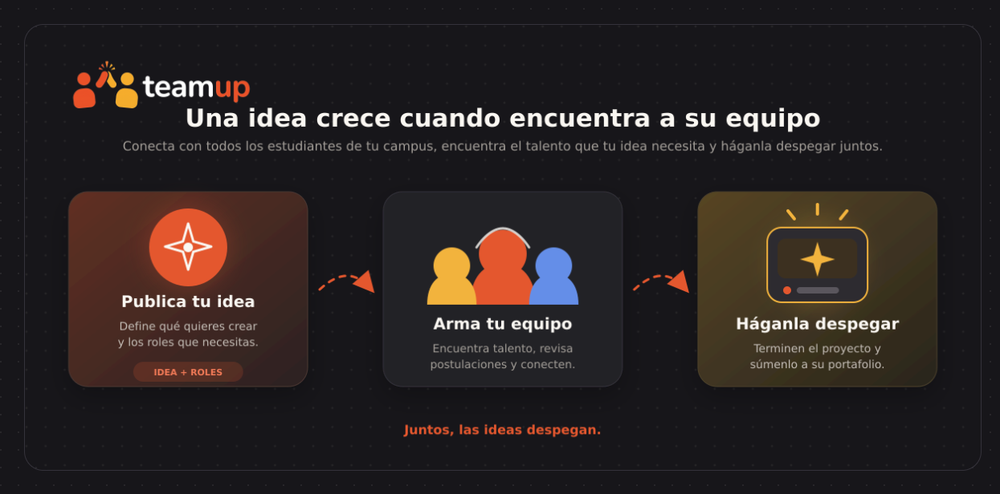

<div align="center">


### Juntos, las ideas despegan.

Conecta con todos los estudiantes de tu campus, encuentra el talento que tu idea necesita y háganla despegar juntos.


</div>

---

## Índice

- [Qué es TeamUp](#qué-es-teamup)
- [El problema](#el-problema)
- [Cómo funciona](#cómo-funciona)
- [Funcionalidades](#funcionalidades)
- [Estado del proyecto](#estado-del-proyecto)
- [Demostración](#demostración)
- [Acceso al proyecto](#acceso-al-proyecto)
- [Tecnologías utilizadas](#tecnologías-utilizadas)
- [Prototipo y arte](#prototipo-y-arte)
- [Personas desarrolladoras](#personas-desarrolladoras)
- [Licencia](#licencia)

## Qué es TeamUp

**TeamUp** es una plataforma web donde los estudiantes de una universidad publican sus proyectos y arman **equipos interdisciplinarios** con compañeros de otras carreras.

No es solo para proyectos de tecnología. Aquí caben cortometrajes, startups, investigaciones, murales, podcasts, ferias, obras de teatro y cualquier idea que necesite más de una persona para hacerse realidad.

> **Ejemplo:** Un estudiante de cine quiere grabar un corto. En TeamUp publica su proyecto y pide un **guionista** (Letras), un **director de fotografía** (Audiovisuales) y **3 extras** (cualquier carrera, sin experiencia). Otros estudiantes se postulan, él arma su equipo, ruedan el corto y al terminar el proyecto queda en la **vitrina**, con créditos para todos.

## El problema

En la universidad hay muchísimo talento, pero repartido en carreras que casi nunca se cruzan:

- Quien tiene una idea **no sabe a quién pedirle ayuda** fuera de su carrera.
- Quien quiere participar en algo **no se entera** de los proyectos que existen.
- Muchos estudiantes terminan la carrera **sin experiencia práctica** que mostrar.

TeamUp funciona como un **semillero de proyectos**: conecta ideas con personas y convierte cada proyecto terminado en experiencia real para el portafolio.

## Cómo funciona

<p align="center">
  
</p>

1. **Publica tu proyecto.** Describe la idea y define los roles que necesitas. Cada rol indica una carrera sugerida (o "cualquier carrera") y si requiere experiencia o no.
2. **Arma tu equipo.** Revisa las postulaciones y acepta a las personas que encajan.
3. **Muéstralo en la vitrina.** Al terminar, el proyecto se exhibe con los créditos de cada participante, y queda en su perfil como experiencia.

## Funcionalidades

| Módulo | Descripción |
|---|---|
| **Autenticación** | Registro e inicio de sesión con correo institucional o nombre de usuario |
| **Perfil** | Carrera, semestre, habilidades, disponibilidad y portafolio de proyectos |
| **Publicar proyecto** | Formulario por pasos: información, roles necesarios, fechas y vista previa |
| **Explorar** | Buscador y filtros por categoría, carrera, experiencia requerida y dedicación |
| **Postulaciones** | Postularse a un rol; el creador acepta o rechaza |
| **Vitrina** | Proyectos terminados con imágenes, video y créditos |

## Estado del proyecto

El proyecto está **en desarrollo**.

| Funcionalidad | Estado |
|---|---|
| Página de inicio (landing) | Terminado |
| Registro con validaciones (alias, nombres, correo, carrera y semestre) | Terminado |
| Inicio y cierre de sesión | Terminado |
| Rutas protegidas: sin sesión redirigen al login | Terminado |
| Publicar, ver, editar y eliminar proyectos | En desarrollo |
| Explorar, postulaciones, perfil y vitrina | Pendiente |

## Demostración

<!-- Agregar aquí el enlace al video (Loom o YouTube) cuando esté grabado -->
El video con la demostración del registro, el inicio de sesión y las rutas protegidas se publicará en esta sección.

## Acceso al proyecto

### Requisitos

- [Python 3.14](https://www.python.org/downloads/) (marcar *Add python.exe to PATH* al instalar)
- [SQL Server](https://www.microsoft.com/sql-server/sql-server-downloads) con Autenticación de Windows
- [ODBC Driver 17 for SQL Server](https://learn.microsoft.com/sql/connect/odbc/download-odbc-driver-for-sql-server)

### Abrir y ejecutar el proyecto

1. Clonar el repositorio:

   ```powershell
   git clone https://github.com/CAMILO-N/TeamUp.git
   cd TeamUp
   ```

2. Crear la base de datos vacía en SQL Server (las tablas y las carreras se crean solas al arrancar):

   ```sql
   CREATE DATABASE TeamUp;
   ```

3. Crear y activar el entorno virtual, e instalar las dependencias:

   ```powershell
   python -m venv venv
   .\venv\Scripts\Activate.ps1
   pip install -r requirements.txt
   ```

4. Arrancar la aplicación:

   ```powershell
   python run.py
   ```

5. Abrir [http://localhost](http://localhost) en el navegador.

### Estructura

El proyecto sigue el patrón **MVC** con Flask:

```
TeamUp/
├── run.py              punto de entrada
├── requirements.txt    dependencias
└── teamup/
    ├── models/         Modelo: clases que representan las tablas (SQLAlchemy)
    ├── templates/      Vista: páginas HTML (Jinja)
    ├── controllers/    Controlador: rutas que reciben la petición y deciden qué hacer
    ├── forms.py        formularios y validaciones (WTForms)
    └── static/         CSS e imágenes
```

## Tecnologías utilizadas

| Tecnología | Uso |
|---|---|
| **Python 3.14** | Lenguaje del backend |
| **Flask** | Framework web, con patrón MVC y Blueprints |
| **Flask-SQLAlchemy** | ORM: las tablas se manejan como clases de Python |
| **SQL Server** + **pyodbc** | Base de datos y conexión |
| **Flask-Login** | Sesiones de usuario y protección de rutas |
| **Flask-WTF** | Formularios, validaciones y protección CSRF |
| **Werkzeug** | Hash de contraseñas |
| **HTML, CSS y Jinja** | Vistas |
| **Figma** | Diseño y prototipo |

## Prototipo y arte

El diseño de la plataforma, la identidad visual y el prototipo navegable están en Figma:

[](https://www.figma.com/make/egdPMLaIE0ehRj88IliyMb/Responsive-Web-Prototype-for-TeamUp?t=sDEuayFbezUxM6km-1)

## Personas desarrolladoras

| [<br><sub>Camilo Núñez</sub>](https://github.com/CAMILO-N) | [<br><sub>Sebastián</sub>](https://github.com/SebastianR18) |
| :---: | :---: |

## Licencia

Proyecto académico desarrollado para la materia **Ingeniería Web**. No tiene licencia de código abierto.

---

<div align="center">

**teamup** · Juntos, las ideas despegan.

</div>
