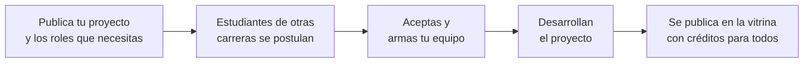

<div align="center">


### Juntos, las ideas despegan.

**La plataforma donde los estudiantes hacen equipo.**
Publica tu proyecto, encuentra compañeros de otras carreras y haz que pase.


</div>

---

## ¿Qué es TeamUp?

**TeamUp** es una plataforma web donde los estudiantes de una universidad publican sus proyectos y arman **equipos interdisciplinarios** con compañeros de otras carreras.

No es solo para proyectos de tecnología. Aquí caben cortometrajes, startups, investigaciones, murales, podcasts, ferias, obras de teatro y cualquier idea que necesite más de una persona para hacerse realidad.

> **Ejemplo:** Un estudiante de cine quiere grabar un corto. En TeamUp publica su proyecto y pide un **guionista** (Letras), un **director de fotografía** (Audiovisuales) y **3 extras** (cualquier carrera, sin experiencia). Otros estudiantes se postulan, él arma su equipo, ruedan el corto y al terminar el proyecto queda en la **vitrina**, con créditos para todos.

## El problema

En la universidad hay muchísimo talento, pero repartido en carreras que casi nunca se cruzan:

- Quien tiene una idea **no sabe a quién pedirle ayuda** fuera de su carrera.
- Quien quiere participar en algo **no se entera** de los proyectos que existen.
- Muchos estudiantes terminan la carrera **sin experiencia práctica** que mostrar.

TeamUp funciona como un **semillero de proyectos**: conecta ideas con personas y convierte cada proyecto terminado en experiencia real para el portafolio.

## Cómo funciona



1. **Publica tu proyecto.** Describe la idea y define los roles que necesitas. Cada rol indica una carrera sugerida (o "cualquier carrera") y si requiere experiencia o no.
2. **Arma tu equipo.** Revisa las postulaciones y acepta a las personas que encajan.
3. **Muéstralo en la vitrina.** Al terminar, el proyecto se exhibe con los créditos de cada participante, y queda en su perfil como experiencia.

## Funcionalidades

| Módulo | Descripción |
|---|---|
| **Autenticación** | Registro e inicio de sesión solo con correo institucional |
| **Perfil** | Carrera, semestre, habilidades, disponibilidad y portafolio de proyectos |
| **Publicar proyecto** | Formulario por pasos: información, roles necesarios, fechas y vista previa |
| **Explorar** | Buscador y filtros por categoría, carrera, experiencia requerida y dedicación |
| **Postulaciones** | Postularse a un rol; el creador acepta o rechaza |
| **Vitrina** | Proyectos terminados con imágenes, video y créditos |

## Cómo correr el proyecto

### Requisitos

- [Python 3.14](https://www.python.org/downloads/) (marcar *Add python.exe to PATH* al instalar)
- [SQL Server](https://www.microsoft.com/sql-server/sql-server-downloads) con Autenticación de Windows
- [ODBC Driver 17 for SQL Server](https://learn.microsoft.com/sql/connect/odbc/download-odbc-driver-for-sql-server)

### Pasos

1. Clonar el repositorio:

   ```powershell
   git clone https://github.com/CAMILO-N/TeamUp.git
   cd TeamUp
   ```

2. Crear la base de datos vacía en SQL Server (las tablas y las carreras se crean solas al arrancar):

   ```sql
   CREATE DATABASE TeamUp;
   ```

3. Crear y activar el entorno virtual, e instalar las dependencias:

   ```powershell
   python -m venv venv
   .\venv\Scripts\Activate.ps1
   pip install -r requirements.txt
   ```

4. Arrancar la aplicación:

   ```powershell
   python run.py
   ```

5. Abrir [http://localhost](http://localhost) en el navegador.

### Estructura

El proyecto sigue el patrón **MVC** con Flask:

```
TeamUp/
├── run.py              punto de entrada
├── requirements.txt    dependencias
└── teamup/
    ├── models/         Modelo: clases que representan las tablas (SQLAlchemy)
    ├── templates/      Vista: páginas HTML (Jinja)
    ├── controllers/    Controlador: rutas que reciben la petición y deciden qué hacer
    ├── forms.py        formularios y validaciones (WTForms)
    └── static/         CSS e imágenes
```

## Prototipo y arte

El diseño de la plataforma, la identidad visual y el prototipo navegable están en Figma:

[](https://www.figma.com/make/egdPMLaIE0ehRj88IliyMb/Responsive-Web-Prototype-for-TeamUp?t=sDEuayFbezUxM6km-1)

---

<div align="center">

**teamup** · Juntos, las ideas despegan.

</div>
